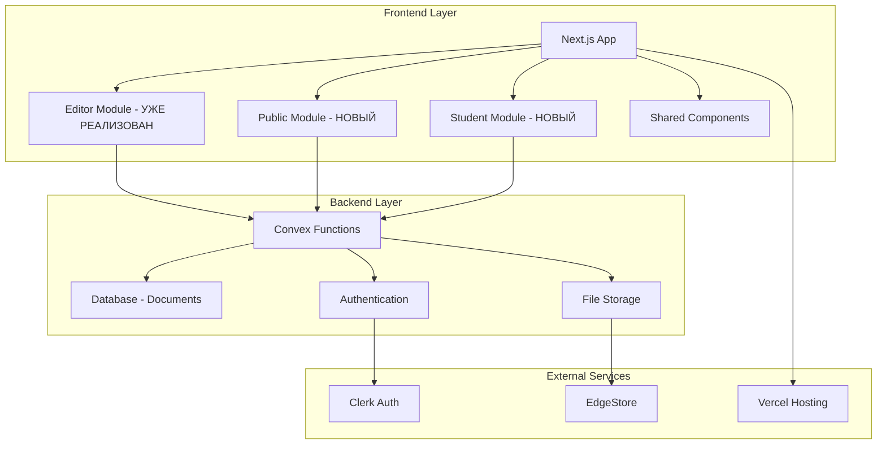
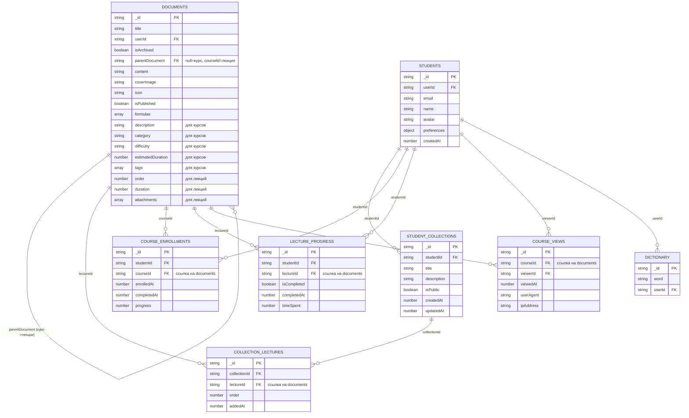
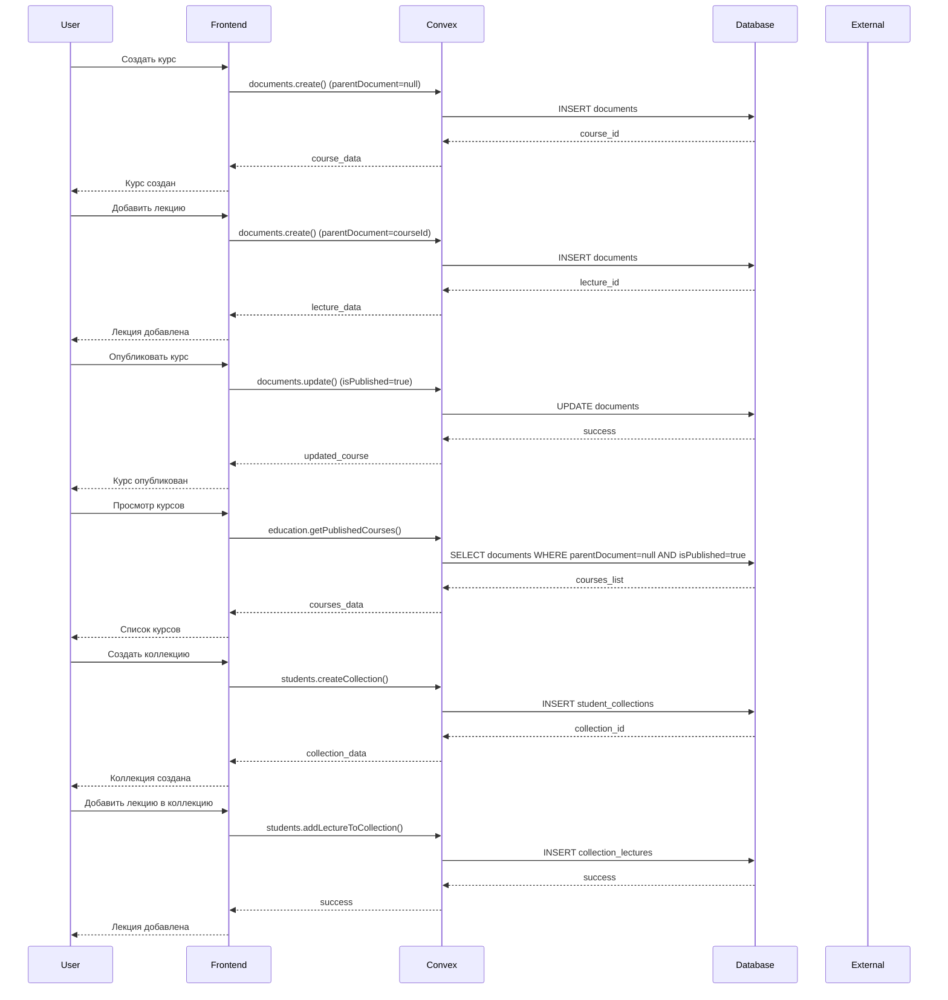
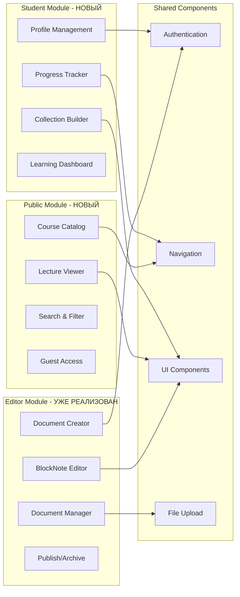
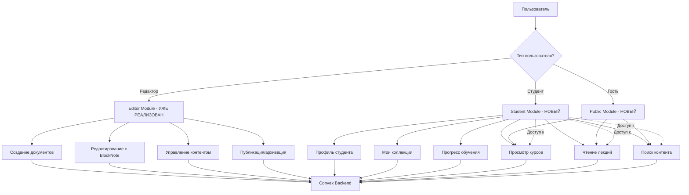
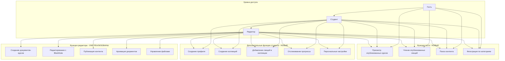
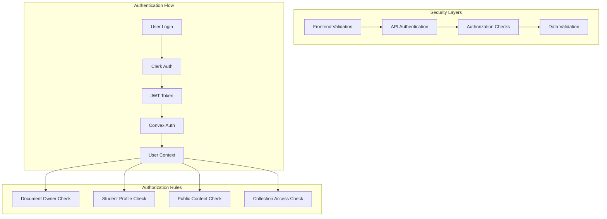
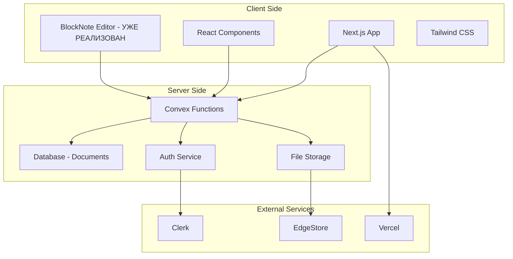
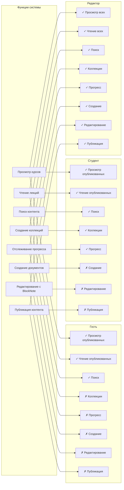

# Диаграмма связей образовательной системы BiGOR 2.0

## Общая архитектура системы



## Структура базы данных (ОБНОВЛЕННАЯ)



## Поток данных в системе (ОБНОВЛЕННЫЙ)



## Модули и их взаимодействие (ОБНОВЛЕННОЕ)



## Поток аутентификации (ОБНОВЛЕННЫЙ)



## Иерархия доступа пользователей (ОБНОВЛЕННАЯ)



## Архитектура безопасности



## Процесс создания и изучения курса (ОБНОВЛЕННЫЙ)

```mermaid
flowchart LR
    subgraph "Course Creation - УЖЕ РЕАЛИЗОВАНО"
        A1[Editor Login] --> A2[Create Document (Course)]
        A2 --> A3[Add Child Documents (Lectures)]
        A3 --> A4[Edit with BlockNote]
        A4 --> A5[Publish Course]
    end

    subgraph "Course Discovery - НОВЫЙ"
        B1[Guest Access] --> B2[Browse Published Courses]
        B2 --> B3[View Course Details]
        B3 --> B4[Read Published Lectures]
    end

    subgraph "Student Learning - НОВЫЙ"
        C1[Student Login] --> C2[Create Collection]
        C2 --> C3[Add Lectures to Collection]
        C3 --> C4[Study Progress]
        C4 --> C5[Track Completion]
    end

    A5 --> B1
    B4 --> C1
    C5 --> A1
```

## Технологическая архитектура



## Матрица доступа пользователей (ОБНОВЛЕННАЯ)



## Структура документов в системе

```mermaid
graph TD
    subgraph "Иерархия документов"
        A[Корневые документы - КУРСЫ] --> B[Вложенные документы - ЛЕКЦИИ]
        B --> C[Вложенные документы - ПОДЛЕКЦИИ]
    end

    subgraph "Пример структуры"
        D[Курс: "Основы программирования"] --> E[Лекция 1: "Введение в Python"]
        D --> F[Лекция 2: "Переменные и типы данных"]
        D --> G[Лекция 3: "Условия и циклы"]
        E --> H[Подлекция 1.1: "Установка Python"]
        E --> I[Подлекция 1.2: "Первая программа"]
    end

    subgraph "Поля документов"
        J[Общие поля: title, userId, isArchived, isPublished]
        K[Поля курсов: description, category, difficulty, tags]
        L[Поля лекций: order, duration, attachments]
    end
```
