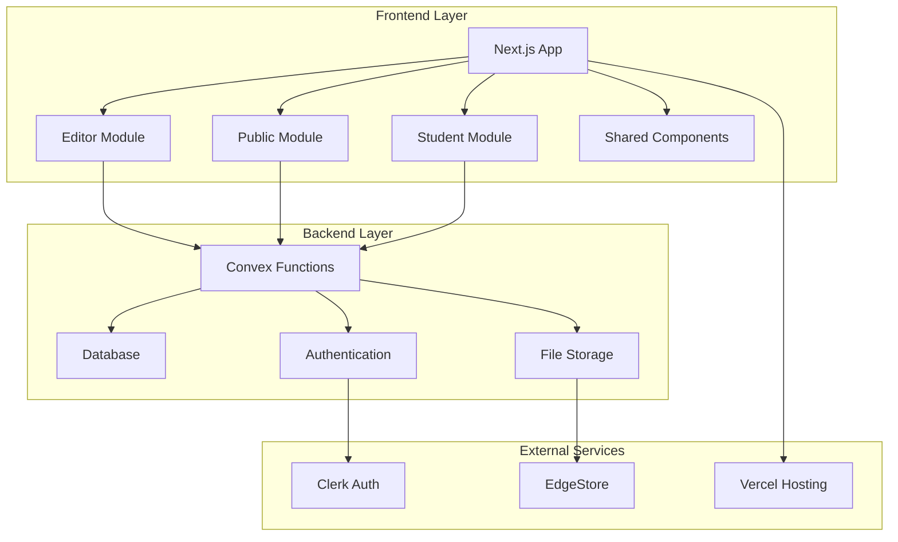
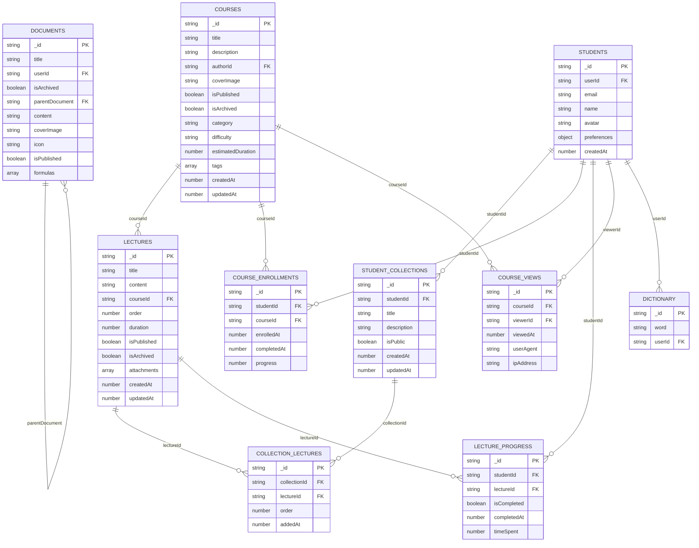
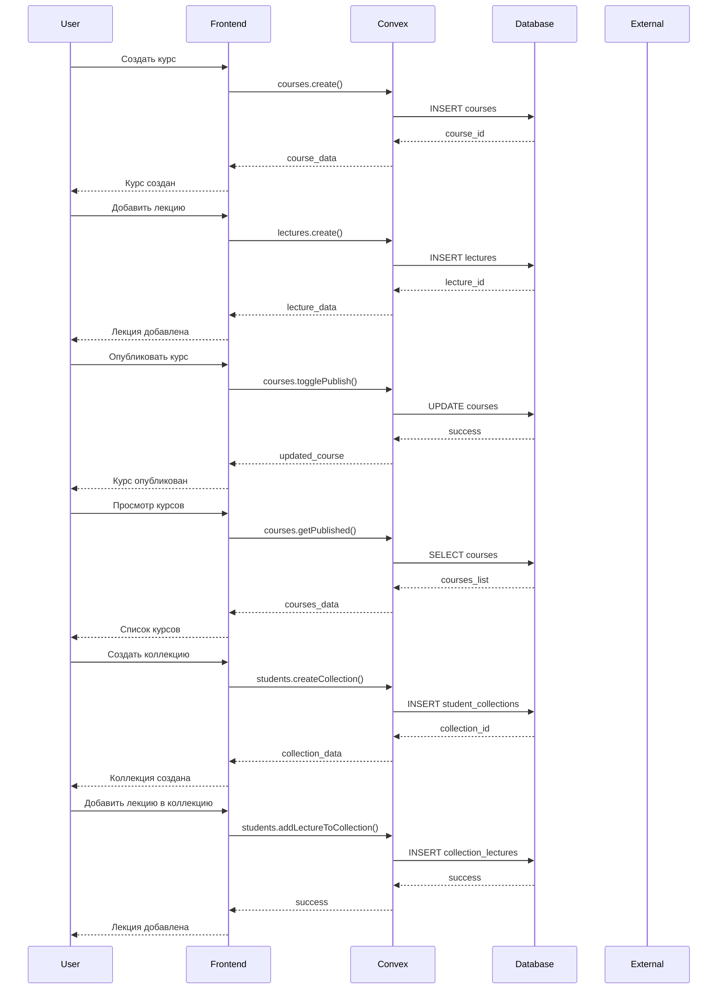
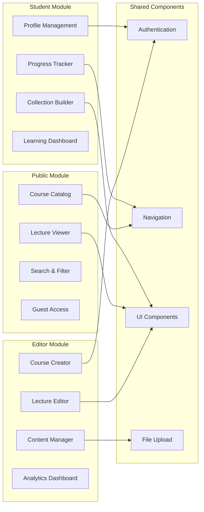
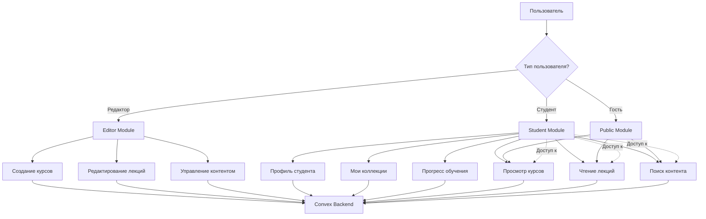
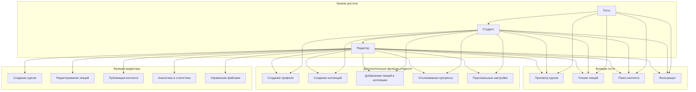
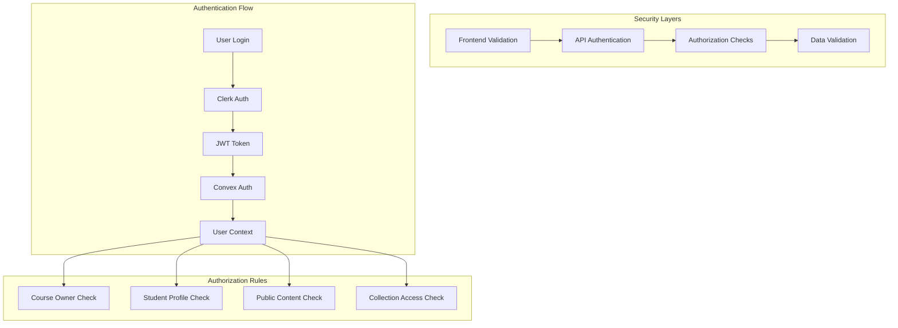
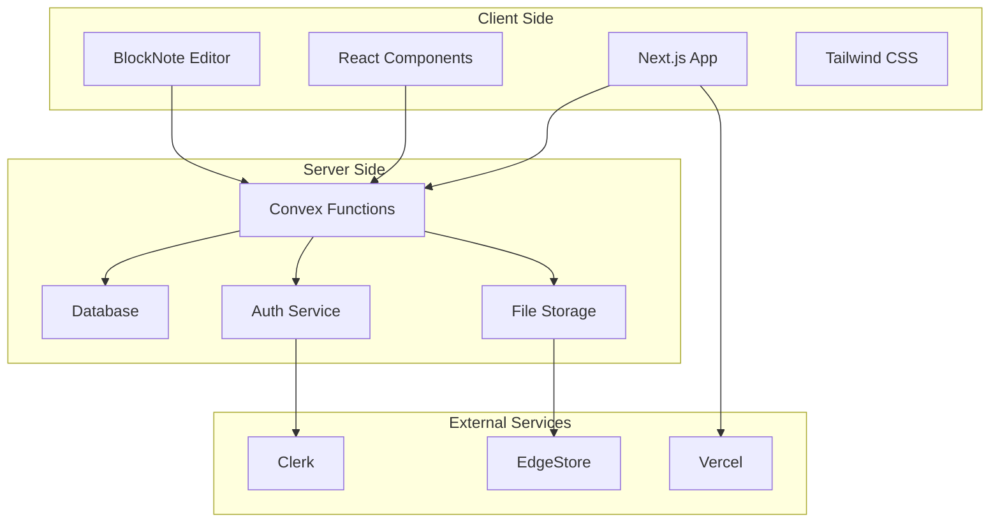
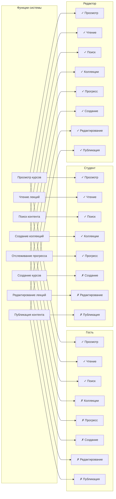

# Диаграмма связей образовательной системы BiGOR 2.0

## Общая архитектура системы

## Структура базы данных

## Поток данных в системе

## Модули и их взаимодействие

## Поток аутентификации (ИСПРАВЛЕННЫЙ)

## Иерархия доступа пользователей

## Архитектура безопасности

## Процесс создания и изучения курса

```mermaid
flowchart LR
    subgraph "Course Creation"
        A1[Editor Login] --> A2[Create Course]
        A2 --> A3[Add Lectures]
        A3 --> A4[Edit Content]
        A4 --> A5[Publish Course]
    end

    subgraph "Course Discovery"
        B1[Guest Access] --> B2[Browse Courses]
        B2 --> B3[View Course Details]
        B3 --> B4[Read Lectures]
    end

    subgraph "Student Learning"
        C1[Student Login] --> C2[Create Collection]
        C2 --> C3[Add Lectures to Collection]
        C3 --> C4[Study Progress]
        C4 --> C5[Track Completion]
    end

    A5 --> B1
    B4 --> C1
    C5 --> A1
```

## Технологическая архитектура

## Матрица доступа пользователей

