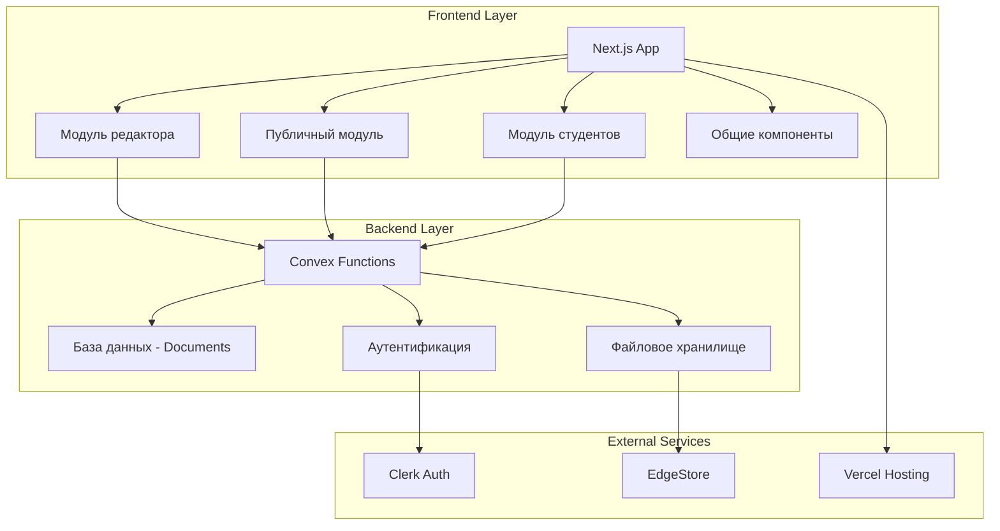
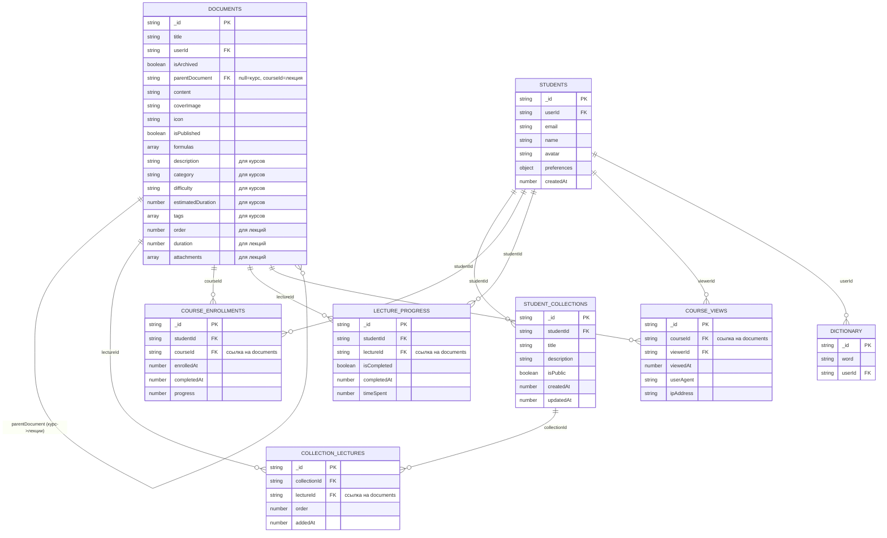
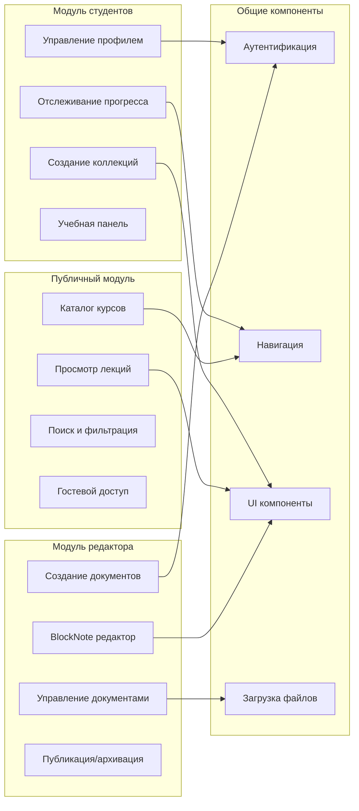
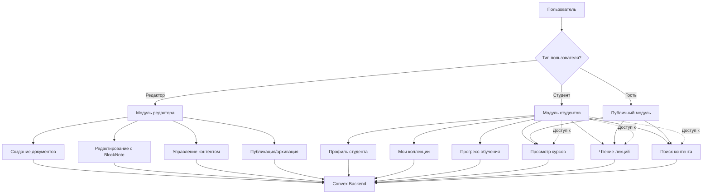
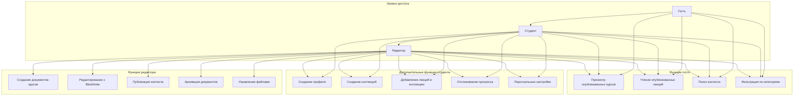
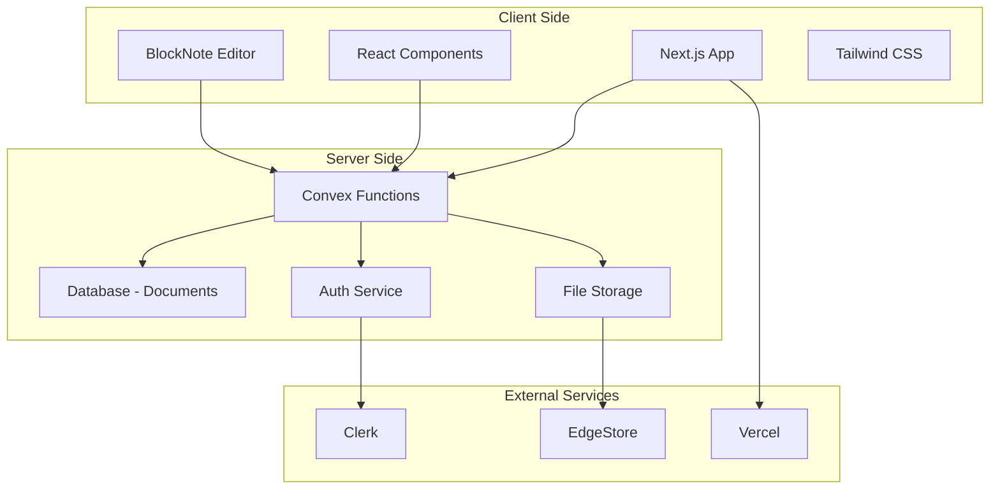
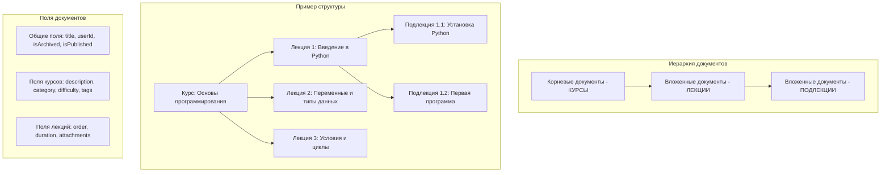

# Диаграмма связей образовательной системы BiGOR 2.0

## Общая архитектура системы

## Структура базы данных (ОБНОВЛЕННАЯ)

## Поток данных в системе (ОБНОВЛЕННЫЙ)

## Модули и их взаимодействие (ОБНОВЛЕННОЕ)

## Поток аутентификации (ОБНОВЛЕННЫЙ)

## Иерархия доступа пользователей (ОБНОВЛЕННАЯ)

## Архитектура безопасности

## Процесс создания и изучения курса (ОБНОВЛЕННЫЙ)

```mermaid
flowchart LR
    subgraph "Создание курса"
        A1[Вход редактора] --> A2[Создание документа-курса]
        A2 --> A3[Добавление вложенных документов-лекций]
        A3 --> A4[Редактирование с BlockNote]
        A4 --> A5[Публикация курса]
    end

    subgraph "Обнаружение курса"
        B1[Гостевой доступ] --> B2[Просмотр опубликованных курсов]
        B2 --> B3[Просмотр деталей курса]
        B3 --> B4[Чтение опубликованных лекций]
    end

    subgraph "Обучение студента"
        C1[Вход студента] --> C2[Создание коллекции]
        C2 --> C3[Добавление лекций в коллекцию]
        C3 --> C4[Прогресс обучения]
        C4 --> C5[Отслеживание завершения]
    end

    A5 --> B1
    B4 --> C1
    C5 --> A1
```

## Технологическая архитектура

## Матрица доступа пользователей (ОБНОВЛЕННАЯ)

## Структура документов в системе

